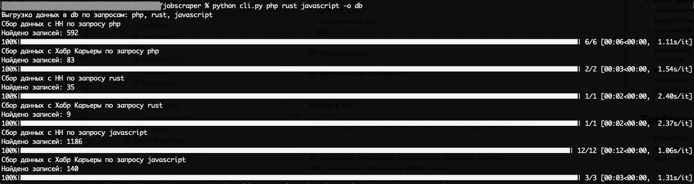
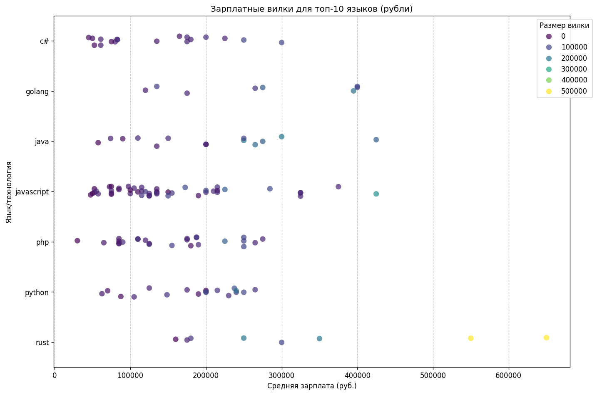
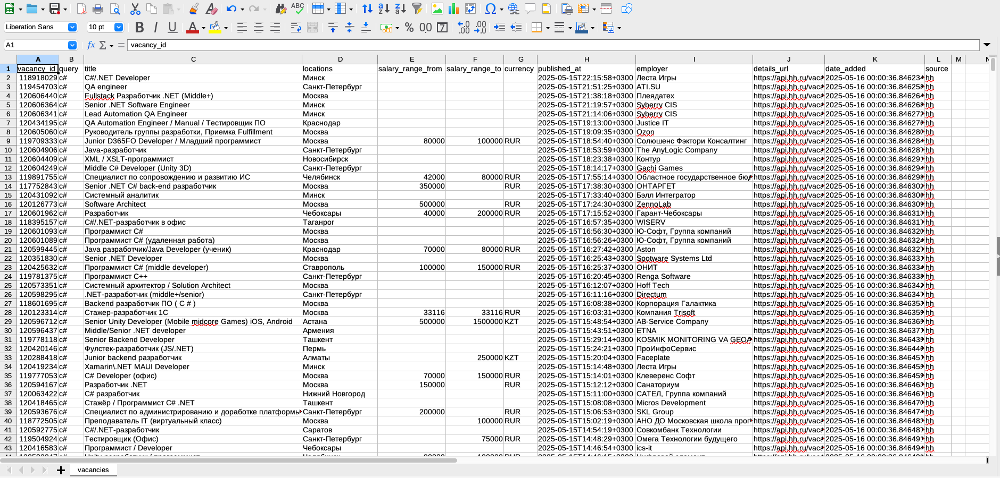
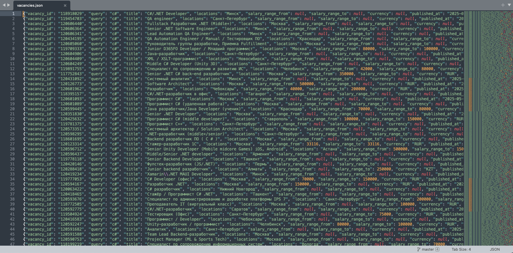
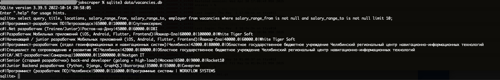

# Сбор данных о вакансиях в IT

Проект имеет, в первую очередь, демонстрационное назначение, поэтому постановка 
задачи и имплементация ее решения обобщенно-условны. Но если кому-то пригодятся 
какие-то фрагменты кода в практических целях, то прекрасно.

## Краткое описание, что делает:
- в настоящий момент собирает данные из двух источников (HH и Хабр Карьера)
- сохраняет их в одном из форматов на выбор (CSV, JSON Lines, а также SQLite3)
- может генерировать графики разброса зарплат в зависимости от специализаций
- есть возможность управления через CLI

## Требования
- Python3.12+
- [requirements.txt](requirements.txt)
- файл `private.py`

В файле `private.py` мы в данном случае символически размещаем ссылки 
на используемые АПИ источников в форме:
```python
HH_URL = ""
HABR_URL = ""
```
Предполагается, что при желании эти значения нетрудно найти, 
в крайнем случае можно обратиться к автору данного проекта.

## Использование
### Установка
Склонировать репозиторий:
```bash
git clone git@github.com:rumpatur/jobscraper.git
```
```bash
cd jobscraper
```
Создать виртуальное окружение:
```bash
python3 -m venv venv
```
Активировать виртуальное окружение и установить зависимости
```bash
. venv/bin/activate
```
```bash
pip install --upgrade pip && pip install -r requirements.txt
```
### Сбор данных
Использование: `cli.py [-h] [-o {csv,json,db}] queries [queries ...]`

Вызов справки
```bash
python cli.py -h
```

Позиционные аргументы:
  `queries`                       Список запросов для поиска вакансий

Опции:
  `-h, --help`                    Справка
  `-o, --output {csv,json,db}`    Формат сохранения данных (csv, json, db)

Примеры запуска:
```bash
# Ищем по словам php rust javascript, сохраняем по умолчанию в CSV
python cli.py php rust javascript
```
```bash
# Ищем по словам ruby, c#, python, сохраняем в sqlite3
python cli.py ruby, c#, python -o db
```
### Генерация графиков
В зависимости от того, какой нужен график, из модуля [analytics.py](analytics.py) 
нужно запустить одну из функций:
* plot_salary_distribution (генерация боксплотов с распределением средних зарплат)
* plot_salary_ranges (генерация графика с вилками зарплат)

**Важно**! Графики генерируются ТОЛЬКО из данных, хранящихся в sqlite3. Для того, 
чтобы построить графики из выгруженных данных, нужно выгрузить их именно 
в базу, то есть скачать с опцией `db`.

## Методические особенности
Любые данные требуют индивидуального подхода и гибкой методики. Один из 
примеров такой индивидуальной ситуации представлен в данном проекте. Данные 
hh имеют ограничение на выдачу API: не более 2000 записей на момент создания 
проекта. То есть если по запросу выдача превышает этот лимит, то часть 
данных получить будет нельзя. Одно из возможных решений в таком случае - 
использование дополнительных фильтров, позволяющих выгружать данные более 
дробными фрагментами. В нашем случае используется ограничитель по времени: 
скрипт берет только данные за последние три дня.

## Примеры результатов
Запуск в CLI:


График распределения зарплат по языкам:


График вилок зарплат по языкам:


Примеры файлов, выгруженных по запросу
```bash
python cli.py c# golang java javascript php python rust
```
* [CSV](samples/vacancies.csv)



* [JSON](samples/vacancies.json)



* [SQLite3](samples/vacancies.db)



## Возможные дальнейшие направления развития проекта
### Расширение источников сбора данных
- написать плагины для приема данных из других источников

### Расширение возможностей управления
- добавить фильтры для более точного определения выборки
- добавить в интерфейс возможность управления фильтрами

### Аналитическое направление
- вычисление других зависимостей
- добавление новых графиков
