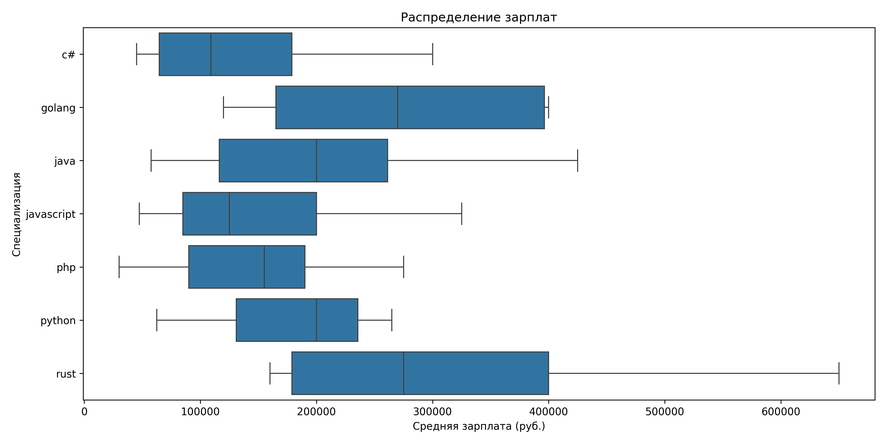

# Сбор данных о вакансиях в IT

Проект имеет, в первую очередь, демонстрационное назначение, поэтому постановка 
задачи и имплементация ее решения обобщенно-условны. Но если кому-то пригодятся 
какие-то фрагменты кода в практических целях, то прекрасно.

## Краткое описание, что делает:
- в настоящий момент собирает данные из двух источников (HH и Хабр Карьера)
- сохраняет их в одном из форматов на выбор (CSV, JSON Lines, а также SQLite3)
- может генерировать графики разброса зарплат в зависимости от специализаций
- есть возможность управления через CLI

## Требования
- Python3.12+
- [requirements.txt](requirements.txt)
- файл `private.py`

В файле `private.py` мы в данном случае символически размещаем ссылки 
на используемые АПИ источников в форме:
```python
HH_URL = ""
HABR_URL = ""
```
Предполагается, что при желании эти значения нетрудно найти, 
в крайнем случае можно обратиться к автору данного проекта.

## Использование

## Методические особенности

## Примеры результатов
Запуск в CLI:


График распределения зарплат по языкам:


График вилок зарплат по языкам:


Примеры файлов, выгруженных по запросу
```bash
python cli.py c# golang java javascript php python rust
```
* [CSV](samples/vacancies.csv)
* [JSON](samples/vacancies.json)
* [SQLite3](samples/vacancies.db)

## Возможные дальнейшие направления развития проекта
### Расширение источников сбора данных
- написать плагины для приема данных из других источников

### Расширение возможностей управления
- добавить фильтры для более точного определения выборки
- добавить в интерфейс возможность управления фильтрами

### Аналитическое направление
- вычисление других зависимостей
- добавление новых графиков
